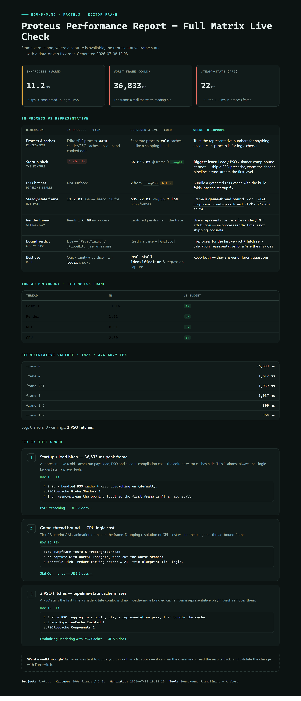

# 🐕 BoundHound

**Frame-rate triage for Unreal Engine 5.8+ — sniffs out whether you're CPU- or GPU-bound _before_ you waste a session optimizing the wrong thing.**

Unreal 5.8's native AI toolsets ship with **no** performance or tracing tools. BoundHound is a small, self-contained editor plugin that fills the gap: a one-call CPU-vs-GPU **bound verdict**, scripted Unreal Insights trace capture, and trace+log analysis — all callable from Python or the engine's native AI toolset (no C++ required to _use_ it).

> The golden rule of profiling: **never optimize before you know which processor is the bottleneck.** A frame is roughly `max(GameThread, RenderThread, RHIThread, GPU)` — only the longest one sets your FPS. Cutting GPU cost does nothing if you're game-thread bound. BoundHound makes that verdict the _first_ thing you see.

---

## One call → a report you can share

`frame_timing()` hands back the verdict as JSON. `report()` turns a whole profiling session into a **self-contained HTML printout** — screenshot it, drop it in Discord, hand it to a teammate. No login, no external assets, no flame graph to read:

<p align="center">
  
</p>

In this one it caught a **36.8-second startup hitch that a warm editor run hid entirely**, pinned the frame as game-thread bound, counted the PSO stalls, and laid the fixes out in priority order — each with the exact console commands and a link to the matching UE docs. That page is just the JSON below, rendered.

---

## Why it exists

Most profilers tell you *where* time goes. They don't tell you *whether the thing you're about to optimize even matters*. `ProfileGPU` will happily hand you a GPU breakdown on a frame that's actually CPU-bound, and send you optimizing shadows for nothing. BoundHound leads with the verdict, then gives you the tools to drill in once you know where to look.

## What you get

```python
import unreal, json
print(json.loads(unreal.BoundHoundService.frame_timing()))
```
```jsonc
{
  "game_thread_ms": 25.1,
  "render_thread_ms": 8.4,
  "gpu_ms": 11.2,
  "rhi_thread_ms": 1.9,
  "frame_ms": 25.1,
  "fps": 39.8,
  "bound": "GameThread",
  "bound_confidence": "clear",   // clear | moderate | marginal | none
  "margin_ms": 13.9,             // how far the bottleneck leads the runner-up
  "contested": false,            // true when the top two threads are within ~10%
  "hint": "CPU game-thread bound. Usual cause: Tick / Blueprint / AI / animation cost. Run 'stat dumpframe -ms=0.5 -root=gamethread' ... dropping r.ScreenPercentage will NOT help a game-thread-bound frame.",
  "budget": {
    "target_fps": 60,
    "budget_ms": 16.67,
    "frame_headroom_ms": -8.44,  // negative = over budget
    "meets_target": false,
    "verdict": "FAIL",
    "threads": {
      "game_thread":   { "ms": 25.1, "headroom_ms": -8.44, "over_budget": true },
      "render_thread": { "ms": 8.4,  "headroom_ms": 8.27,  "over_budget": false },
      "gpu":           { "ms": 11.2, "headroom_ms": 5.47,  "over_budget": false }
    }
  },
  "pie_running": true
}
```

One call, and you know: **25.1 ms on the game thread caps you at ~40 FPS no matter what you do to the GPU** — and it `FAIL`s a 60 FPS budget on the game thread alone. That's the whole pitch.

Pass a target to gate against a different frame rate: `frame_timing(120)`. When the top two threads are within ~10% the verdict reports `contested: true` and names the runner-up in `contested_with`, so you don't chase a false winner that frame-to-frame noise can flip. When `gpu_ms` is `0` (GPU timing unavailable) a CPU verdict is downgraded to `moderate` confidence — a hidden GPU cost could still be the real bottleneck.

## How it compares

BoundHound doesn't measure anything the engine can't already show you — the frame split is the same `GGameThreadTime` / `GRenderThreadTime` / `RHIGetGPUFrameCycles` that feeds `stat unit`. What's new is that it **adjudicates** that data into a decision and hands it back as structured output an agent can act on. Everything else makes you the adjudicator.

| | **BoundHound** | `stat unit` | Unreal Insights | `ProfileGPU` | Superluminal / PIX / RAD |
|---|:---:|:---:|:---:|:---:|:---:|
| **Emits a CPU-vs-GPU _verdict_** (not just numbers) | ✅ | ❌ | ❌ | ❌ | ❌ |
| **Confidence / contested-tie honesty** | ✅ | ❌ | ❌ | ❌ | ❌ |
| **Machine-readable output** (JSON) | ✅ | ❌ (overlay) | ⚠️ export | ❌ (log) | ⚠️ export |
| **Callable by an AI agent as a tool** | ✅ | ❌ | ❌ | ❌ | ❌ |
| **Ships the triage _strategy_** (agent skill) | ✅ | ❌ | ❌ | ❌ | ❌ |
| **Per-thread budget gate** (PASS/FAIL vs target FPS) | ✅ | ❌ | ❌ | ❌ | ❌ |
| **Works headless / no GUI, no screenshots** | ✅ | ❌ | ⚠️ server | ❌ | ❌ |
| **Scripted trace capture** (start/stop/regions/bookmarks) | ✅ | ❌ | ⚠️ manual | ❌ | ⚠️ manual |
| **Ground-truth self-validation** (`force_hitch`) | ✅ | ❌ | ❌ | ❌ | ❌ |
| Deep per-scope / per-drawcall timeline | ⚠️ via trace | ❌ | ✅ | ✅ | ✅ |
| Zero-overhead sampling profiler | ❌ | ✅ | ⚠️ | ❌ | ✅ |

The incumbents win on *depth* — once you know **where** to look, Insights and Superluminal give you a far richer timeline than BoundHound ever will. BoundHound wins on the step *before* that: telling you **which processor** to look at at all, as a decision an agent (or a human in a hurry) can act on without reading a single flame graph. The two are complementary — the recommended flow literally ends by handing off to a trace.

## API

| Method | Purpose |
|--------|---------|
| `frame_timing()` | Game/Render/GPU/RHI thread ms + a CPU-vs-GPU `bound` verdict and `hint`. **Run first.** |
| `force_hitch(thread="game", milliseconds=250, frames=1)` | Test helper: deliberately stall `game`/`render`/`both`/`rhi`/`gpu`. CPU + RHI paths self-validate in one call (`verdict_matched_expect`); `gpu` reads back via `frame_timing`. `rhi` needs RHI-threading on (else it reports `rhi_threading:false` and skips the stall). |
| `start_trace(name, channels)` | Start an Unreal Insights trace to file (default channel set if `channels` empty). |
| `stop_trace()` | Stop the active trace; returns file path + size. |
| `get_trace_status()` | Whether a trace is active and which channels are enabled. |
| `bookmark(name)` | Drop a point-in-time bookmark in the active trace. |
| `region_start(name)` / `region_end(name)` | Begin / end a named region span in the trace. |
| `analyse(source, file)` | Read back a trace and/or log → frame stats, worst frames, hitches, notable log lines. |
| `start_standalone(name, channels)` | Launch the game as a separate standalone process with a trace attached (+ its own timestamped log). |
| `stop_standalone()` / `get_standalone_status()` | Control / inspect the standalone capture. |
| `start_pie()` / `stop_pie()` | Start/stop **in-process** Play-In-Editor so `frame_timing`/`force_hitch` read a live game world. Quick checks only — see note below. |
| `report(title, source="both", file="")` | Render a **self-contained HTML "printout"** — the live verdict + budget and (when a capture is available) the frame stats, worst frames and PSO hitches, plus a data-driven "fix in this order" list — to `Saved/BoundHound/report_<ts>.html`. Portable: open in any browser, screenshot, or share. |

All methods return a JSON string. Full workflow and gotchas in [`docs/USAGE.md`](docs/USAGE.md).

> **PIE vs Standalone.** A live game world makes any `frame_timing` reading representative, so prefer
> `start_pie()` or a standalone session over the bare editor viewport. **Prefer `start_standalone()` for
> real stall identification**: PIE reuses the editor's already-warm shader/PSO caches and on-demand cooked
> data, so it hides costs a standalone or shipping build actually pays. Use PIE for quick in-process checks.
> (Note: `force_hitch`'s CPU paths are **self-validating** — they time their own stall and return
> `verdict_matched_expect`, so no racy follow-up `frame_timing` is needed; only `gpu` reads back via a
> following-frame `frame_timing`.)

## AI Assistant skill (zero setup)

The plugin ships a native **AgentSkill** (`UBoundHoundTriageSkill`) that teaches UE 5.8's AI Assistant *how* to use these tools — the strategy layer on top of the per-tool descriptions (frame_timing first → interpret the verdict → act per thread → trace → validate with force_hitch). Because UE discovers skills by scanning `UAgentSkill` subclasses (native classes included) and the default allow/block lists are empty, it is **auto-registered on plugin load** — no content asset, no config. The Assistant finds it via `list_skills` and reads it via `get_skills`.

## Recommended flow

```python
import unreal, json

# 1. CPU vs GPU verdict FIRST (start PIE, park in a representative spot)
print(json.loads(unreal.BoundHoundService.frame_timing()))

# 2. Capture a clean trace around the workload
unreal.BoundHoundService.start_trace("combat_encounter")
unreal.BoundHoundService.region_start("wave_spawn")
# (trigger the gameplay here)
unreal.BoundHoundService.region_end("wave_spawn")
print(json.loads(unreal.BoundHoundService.stop_trace()))

# 3. Summarise without leaving Python
print(json.loads(unreal.BoundHoundService.analyse("both")))
```

## Using it from an AI agent (MCP)

Everything above drives BoundHound from the editor's **Python** console. You can also drive it from an
AI agent, because BoundHound auto-registers with UE 5.8's native **`ToolsetRegistry`** — the same
surface both the **in-editor AI Assistant** and any **external MCP bridge** consume. Nothing about the
plugin needs configuring for either; you only stand up the agent surface, and BoundHound is already on
it.

There are two ways in.

### Option A — in-editor AI Assistant (nothing to install beyond the engine)

UE 5.8 ships an experimental **AI Assistant** plugin that talks to `ToolsetRegistry` directly, so it
sees BoundHound with **zero setup** — no bridge, no ports, no config files.

1. *Edit → Plugins* → enable **AI Assistant** (Experimental) and restart the editor. It pulls in
   `ToolsetRegistry`, which BoundHound already registers into.
2. Open the Assistant panel and just ask it in plain language, e.g.
   *"Use the BoundHound service to check the current frame timing"* or *"Verify BoundHound is working —
   run its frame_timing tool and show me the verdict."*
3. It calls `BoundHoundService.frame_timing` and hands back the JSON verdict. That round-trip **is** the
   "is BoundHound wired up?" check.

### Option B — external MCP client (Claude Code, etc.)

To reach BoundHound from an MCP client outside the editor, you need an **MCP bridge plugin that exposes
`ToolsetRegistry` over MCP**, running in the *same editor process* as BoundHound. BoundHound does not
ship one — in this project that role is filled by a separate plugin, **UnrealMCP**, which serves an
in-process endpoint at **`http://127.0.0.1:8000/mcp`** (streamable-HTTP, no proxy, no token) whenever
the editor is running with it loaded. Any equivalent ToolsetRegistry-over-MCP bridge works the same way.

1. **Install the bridge.** Enable your MCP bridge plugin (e.g. UnrealMCP) in the project alongside
   BoundHound, and launch the editor. The endpoint only listens while that editor is open.
2. **Point your client at it.** For Claude Code, add a project-level `.mcp.json`:
   ```jsonc
   { "mcpServers": { "UnrealMCP": { "type": "http", "url": "http://127.0.0.1:8000/mcp" } } }
   ```
   and enable it in `.claude/settings.local.json`:
   ```jsonc
   { "enabledMcpjsonServers": ["UnrealMCP"] }
   ```
   Both load at session start, so start a **fresh** session and confirm the server connected with
   `/mcp`.
3. **Note the tool surface.** UnrealMCP is a **meta-interface** — it does *not* expose each method as
   its own MCP tool. There are three top-level tools: `list_toolsets`, `describe_toolset`
   (`toolset_name` arg), and `call_tool`. You reach BoundHound through `call_tool`, and the method
   names are **PascalCase** (the C++ names), not the Python `snake_case`:

   | Python console | via `call_tool` |
   |---|---|
   | `unreal.BoundHoundService.frame_timing(60)` | toolset `BoundHound.BoundHoundService`, tool `FrameTiming`, args `{ "targetFPS": 60 }` |
   | `unreal.BoundHoundService.start_trace(...)` | tool `StartTrace` |
   | `unreal.BoundHoundService.force_hitch(...)` | tool `ForceHitch` |

**First-run smoke test (Option B):**

1. Call `list_toolsets` → you should see **`BoundHound.BoundHoundService`** (and
   `ToolsetRegistry.AgentSkillToolset`, which carries the triage skill below).
2. `call_tool` → `FrameTiming` with `{ "targetFPS": 60 }` → you should get the frame-split JSON back.

If step 1 is missing the toolset, BoundHound isn't loaded in that editor (rebuild/enable it — see
**Install**). If the bridge itself doesn't appear under `/mcp`, the editor isn't running or the bridge
plugin isn't loaded. Either way, a result with `"pie_running": false` just means you're reading the
bare editor viewport — start PIE for a representative reading, same as the Python flow.

## Install

1. Copy this folder into your project's `Plugins/` directory (i.e. `YourProject/Plugins/BoundHound/`).
2. Regenerate project files and rebuild the editor target (it's a code plugin).
3. Enable **BoundHound** in *Edit → Plugins* if it isn't already.

**Requires Unreal Engine 5.8+** — it builds on the native `ToolsetRegistry` and `TraceServices`. Trace files land under `YourProject/Saved/Profiling/`.

## How it works

BoundHound is a single `UToolsetDefinition` subclass exposing static `AICallable` methods. On startup it auto-registers itself with UE 5.8's native `ToolsetRegistry`, so the methods show up both in Python (`unreal.BoundHoundService.*`) and on the engine's AI/MCP toolset surface. The frame split is read straight from engine globals (`GGameThreadTime` / `GRenderThreadTime` / `RHIGetGPUFrameCycles`) — the same data behind the `stat unit` overlay — so there are no screenshots to OCR and it works headless.

## Testing

BoundHound ships a headless automation suite over the verdict + budget logic. Run it after any
non-trivial change and before promoting work — one command, no editor window, no GPU:

```powershell
# from Plugins/BoundHound/ (build the editor target first)
./RunTests.ps1     # -> Result: succeeded=14 failed=0 notRun=0 ; exits non-zero on failure
```

Full details, coverage, and how to add a test: [`docs/TESTING.md`](docs/TESTING.md).

## License

MIT — see [LICENSE](LICENSE). Do whatever you like with it.

## Roadmap ideas

- **Baseline + diff** ("game thread +3.2 ms since last capture").
- **Auto drill-down**: when `bound == GameThread`, fire `stat dumpframe` and parse the worst scopes automatically.

PRs and issues welcome.
